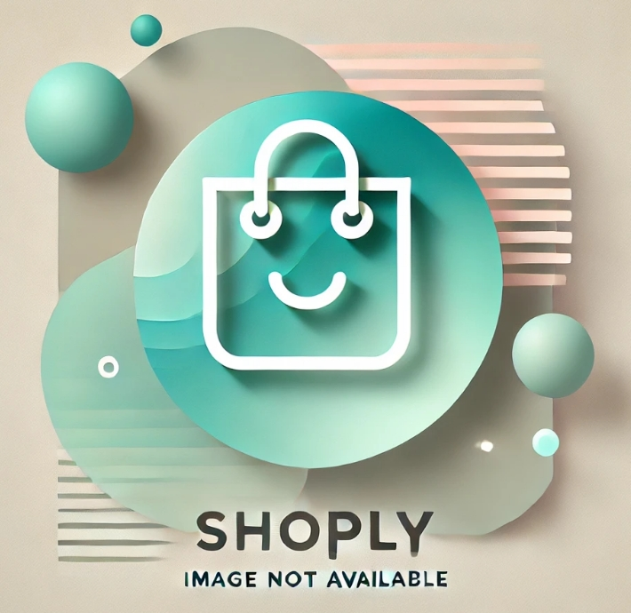

# [Shoply: An eCommerce Platform Built for Success](https://shoply-93586e37ffa3.herokuapp.com)

[](https://github.com/patrickaod/Shoply/commits/main)
[](https://github.com/patrickaod/Shoply/commits/main)
[](https://github.com/patrickaod/Shoply)

Shoply is a full-featured eCommerce platform developed using [Django 5](https://www.djangoproject.com/), designed to demonstrate advanced web development skills while providing a practical, scalable, and modern solution for online shopping. The project leverages a powerful tech stack, including [Stripe](https://stripe.com/gb) for secure payments, [Bootstrap 5](https://getbootstrap.com/) for responsive design, [Django Allauth](https://docs.allauth.org/en/latest/) for seamless authentication, and custom commands for streamlined data integration.

## Project Overview

Shoply is not just a technical exercise but a fully operational eCommerce site that demonstrates the ability to design, build, and deploy a comprehensive web application. A key feature of the platform is its ability to populate content dynamically using datasets sourced from [Kaggle](https://www.kaggle.com/) via [Django management commands](https://docs.djangoproject.com/en/5.1/ref/django-admin/). This feature reflects real-world scenarios where developers must manage and integrate large-scale data efficiently.

Core features include:

- Dynamic Product Listings: Populated using datasets downloaded and processed from [Kaggle](https://www.kaggle.com/).
- Secure Payment Integration: Powered by [Stripe](https://stripe.com/gb) for robust and flexible transactions.
- Responsive Design: A sleek, mobile-first interface built with [Bootstrap 5](https://getbootstrap.com/).
- User Authentication: Simplified and secure logins using [Django Allauth](https://docs.allauth.org/en/latest/).
- Interactive Features: Enhanced accessability, interactivity and usability with [jQuery](https://jquery.com/).


## UX

I built Shoply around datasets that I downloaded and processed through my custom data pipeline, using the insights they provided to shape every aspect of the website. By allowing the data to guide the design, I created a platform that’s not only clear and responsive but also deeply engaging for users. Features like "Recently Viewed" and "Top Trending" are powered directly by user behavior and sales data, creating a personalized experience that keeps customers coming back. The dynamic admin interface makes managing product listings effortless, while the navigation automatically adjusts to category changes with liquid formatting, ensuring a smooth and intuitive browsing experience. To further enhance the platform's appeal, I incorporated a unique logo, crafted using DALL·E, giving Shoply a fresh, modern identity that stands out.

### Colour Scheme
I first leveraged [DALL·E](https://openai.com/index/dall-e-3/) to generate an original and distinctive no-image found .jpeg that aligned with the modern aesthetic I wanted for the platform. 



After obtaining the image from [DALL·E](https://openai.com/index/dall-e-3/), I used [pixlr](https://pixlr.com/express/) (a free photo editing suite) to crop out the site’s logo and isolate it for integration into the design. 


Next, I turned to [Coolors](https://coolors.co/), a color palette generator, to select a cohesive color scheme that would complement the logo and enhance the overall aesthetic of the site. After experimenting with various options, chose a color palette that balances cool blues and warm accents to evoke a sense of trust, professionalism, and approachability.

#### Colour Scheme Extraction

#### Final Colour Scheme

- Kepple: `#3FB2A5` used for primary text
- Dark Green: `#043A30` used for secondary text
- Honeydew: `#D0EFDF` used for neutral tones
- Black: `#000000` used for dark text
- Gamboge: `#f39c12` used for contrasting accents

I've implemented them as CSS `:root` variables to easily update the global colour scheme by changing only one value, instead of everywhere in the CSS file.

```css
:root {
  /* Light Green */
  --primary-color: #3FB2A5;
  /* Dark Green */
  --secondary-color: #043A30;
  /* Off-White / Light Mint */
  --neutral-light: #D0EFDF;
  /* Black */
  --text-dark: #000000;
  /* Orange */
  --accent-color: #f39c12;
}
```

### Typography

- [Poppins](https://fonts.google.com/specimen/Poppins) was used for the primary headers and titles.

- [Roboto](https://fonts.google.com/specimen/Roboto) was used for all other secondary text.

- [Pacifico](https://fonts.google.com/specimen/Pacifico) was used for the accent text.

- [Font Awesome](https://fontawesome.com) icons were used throughout the site, such as the account and basket icons in the navigation.

## User Stories

### Shopper

- As a shopper, I would like to view a list of products, so that I can select some to purchase.
- As a shopper, I would like to view specific categories, so that I can find something quickly.
- As a shopper, I would like to select out a product, so that I focus on the product itself.


### New Site Users

- As a new site user, I would like to easily login, so that I can access my information quickly.
- As a new site user, I would like to easily register, so that I can view my personal profile.
- As a new site user, I would like to recieve email confirmation, so that I can verify my purchase.

### Returning Site Users

- As a returning site user, I would like to have my orders saved, so that I can review my purchases.
- As a returning site user, I would like to quick access to products I've seen before, so that I don't have to write anything down.
- As a returning site user, I would like to quickly see the most popular items, so that I can find some quick christmas gifts.

### Site Admin

- As a site administrator, I should be able to modify profiles, so that I can maintain site security.
- As a site administrator, I should be able to see all products, so that I can check site inventory.
- As a site administrator, I should be able to see change products, so that I can update site inventory.
