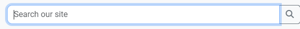
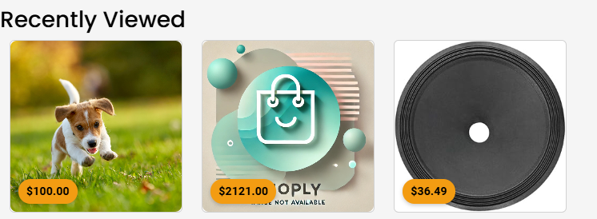
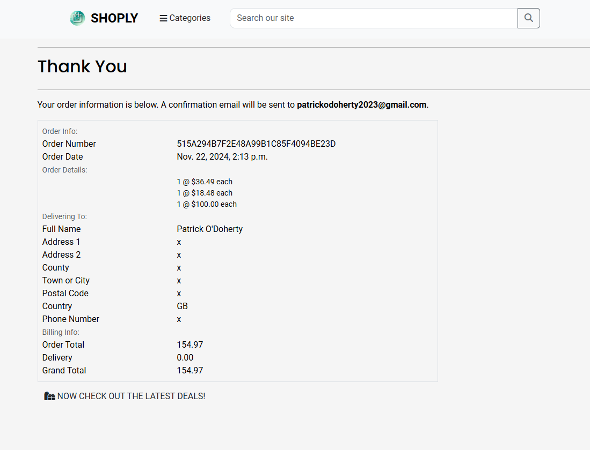

# [Shoply: An eCommerce Platform Built for Success](https://shoply-93586e37ffa3.herokuapp.com)

[](https://github.com/patrickaod/Shoply/commits/main)
[](https://github.com/patrickaod/Shoply/commits/main)
[](https://github.com/patrickaod/Shoply)

Shoply is a full-featured eCommerce platform developed using [Django 5](https://www.djangoproject.com/), designed to demonstrate advanced web development skills while providing a practical, scalable, and modern solution for online shopping. The project leverages a powerful tech stack, including [Stripe](https://stripe.com/gb) for secure payments, [Bootstrap 5](https://getbootstrap.com/) for responsive design, [Django Allauth](https://docs.allauth.org/en/latest/) for seamless authentication, and custom commands for streamlined data integration.

## Project Overview

Shoply is not just a technical exercise but a fully operational eCommerce site that demonstrates the ability to design, build, and deploy a comprehensive web application. A key feature of the platform is its ability to populate content dynamically using datasets sourced from [Kaggle](https://www.kaggle.com/) via [Django management commands](https://docs.djangoproject.com/en/5.1/ref/django-admin/). This feature reflects real-world scenarios where developers must manage and integrate large-scale data efficiently.

Core features include:

- Dynamic Product Listings: Populated using datasets downloaded and processed from [Kaggle](https://www.kaggle.com/).
- Secure Payment Integration: Powered by [Stripe](https://stripe.com/gb) for robust and flexible transactions.
- Responsive Design: A sleek, mobile-first interface built with [Bootstrap 5](https://getbootstrap.com/).
- User Authentication: Simplified and secure logins using [Django Allauth](https://docs.allauth.org/en/latest/).
- Interactive Features: Enhanced accessability, interactivity and usability with [jQuery](https://jquery.com/).


## UX

I built Shoply around datasets that I downloaded and processed through my custom data pipeline, using the insights they provided to shape every aspect of the website. By allowing the data to guide the design, I created a platform that’s not only clear and responsive but also deeply engaging for users. Features like "Recently Viewed" and "Top Trending" are powered directly by user behavior and sales data, creating a personalized experience that keeps customers coming back. The dynamic admin interface makes managing product listings effortless, while the navigation automatically adjusts to category changes with liquid formatting, ensuring a smooth and intuitive browsing experience. To further enhance the platform's appeal, I incorporated a unique logo, crafted using DALL·E, giving Shoply a fresh, modern identity that stands out.

### Colour Scheme
I first leveraged [DALL·E](https://openai.com/index/dall-e-3/) to generate an original and distinctive no-image found .jpeg that aligned with the modern aesthetic I wanted for the platform. 


After obtaining the image from [DALL·E](https://openai.com/index/dall-e-3/), I used [pixlr](https://pixlr.com/express/) (a free photo editing suite) to crop out the site’s logo and isolate it for integration into the design. 


Next, I turned to [Coolors](https://coolors.co/), a color palette generator, to select a cohesive color scheme that would complement the logo and enhance the overall aesthetic of the site. After experimenting with various options, chose a color palette that balances cool blues and warm accents to evoke a sense of trust, professionalism, and approachability.

#### Colour Scheme Extraction

#### Final Colour Scheme

- Kepple: `#3FB2A5` used for primary text
- Dark Green: `#043A30` used for secondary text
- Honeydew: `#D0EFDF` used for neutral tones
- Black: `#000000` used for dark text
- Gamboge: `#f39c12` used for contrasting accents

I've implemented them as CSS `:root` variables to easily update the global colour scheme by changing only one value, instead of everywhere in the CSS file.

```css
:root {
  /* Light Green */
  --primary-color: #3FB2A5;
  /* Dark Green */
  --secondary-color: #043A30;
  /* Off-White / Light Mint */
  --neutral-light: #D0EFDF;
  /* Black */
  --text-dark: #000000;
  /* Orange */
  --accent-color: #f39c12;
}
```

### Typography

- [Poppins](https://fonts.google.com/specimen/Poppins) was used for the primary headers and titles.

- [Roboto](https://fonts.google.com/specimen/Roboto) was used for all other secondary text.

- [Pacifico](https://fonts.google.com/specimen/Pacifico) was used for the accent text.

- [Font Awesome](https://fontawesome.com) icons were used throughout the site, such as the account and basket icons in the navigation.

## User Stories

### Shopper

- As a shopper, I would like to view a list of products, so that I can select some to purchase.
- As a shopper, I would like to view specific categories, so that I can find something quickly.
- As a shopper, I would like to select out a product, so that I focus on the product itself.


### New Site Users

- As a new site user, I would like to easily login, so that I can access my information quickly.
- As a new site user, I would like to easily register, so that I can view my personal profile.
- As a new site user, I would like to recieve email confirmation, so that I can verify my purchase.

### Returning Site Users

- As a returning site user, I would like to have my orders saved, so that I can review my purchases.
- As a returning site user, I would like to quick access to products I've seen before, so that I don't have to write anything down.
- As a returning site user, I would like to quickly see the most popular items, so that I can find some quick christmas gifts.

### Site Admin

- As a site administrator, I should be able to modify profiles, so that I can maintain site security.
- As a site administrator, I should be able to see all products, so that I can check site inventory.
- As a site administrator, I should be able to see change products, so that I can update site inventory.
## Features

### Existing Features

- **Logo Brand**

    - The logo and brand name provide a easy site wide return to home familiar to all regular internet users.


- **Categories Dropdown**

    - The Categories Dropdown dynamically updates depending what data has been uploaded with the field `categoryName`. 


- **Search Bar**

    - The search bar allows users to quickly narrow the products selection by title or category.



- **Profile Icon**

    - The fontawesome [user icon](https://fontawesome.com/icons/user?f=classic&s=solid) dynamically displays options depending on session status. 


- **Shopping Bag - Basket Icon**

    - The shopping bag is accessed site wide through the navigation's fontawesome [basket icon](https://fontawesome.com/icons/basket-shopping?s=solid)


- **Welcome - Call To Action**

    - Upon arrival the user/shopper is greeted by a busy festive shoppers creating a sense of motion. A big call to action is centered in frosted glass (`The new collections are here`) in Poppins font next to another bright Gamboge orange call to action button with more festive features 🎄. 


- **Trending Now**

    - The trending now feature looks for items with the `isBestSeller` field and places a random selection using the [random module](https://docs.python.org/3/library/random.html) on a users homescreen.

```py 
# Get all bestseller products
    bestseller_products = list(Product.objects.filter(isBestSeller=True))
    # Shuffle and pick up to 5
    trending_products = random.sample(bestseller_products, min(len(bestseller_products), 5))

```


- **Recently Viewed**

    - A random selection of up to 5 recently viewed items will be displayed here, sourced from cookies for anonymous users and from the database for account holders.

```py
# Fetch recently viewed products
    recently_viewed_products = []
    if request.user.is_authenticated:
        # For logged-in users: fetch from the database
        recent_views = RecentlyViewedProduct.objects.filter(user=request.user).select_related('product')[:10]
        recently_viewed_products = [view.product for view in recent_views]
    else:
        # For anonymous users: fetch from session
        recently_viewed_ids = request.session.get('recently_viewed', [])
        recently_viewed_products = Product.objects.filter(id__in=recently_viewed_ids)

    # Randomly sample up to 5 recently viewed products
    recently_viewed_sample = random.sample(
        list(recently_viewed_products),
        min(len(recently_viewed_products), 5)
    )
```


- **Price Tag**

    - The updates dynamically according to the items price listed in the database. 


- **Products**

    - The products section utilises using bootstraps helper classes to responively layout all the desired product cards.


- **Product Cards**

    - The product card provides a quick snapshot of the product, displaying only the truncated title and price for simplicity. It includes a subtle hover effect, elevating the card to offer visual feedback to the user. A vibrant gamboge-orange 'View [More] Details' button adds an eye-catching call-to-action.


- **Pagination**

    - Pagination improves user experience by breaking down large sets of data into manageable chunks. It also enhances performance by loading only a portion of the data at a time.


- **Product Details**

    - The Product Details page provides an in-depth view of the product in a clean and user-friendly layout. A large image on the left expands for a closer look, while all the product details are prominently displayed in a section directly beside it. The title is fully visible (untruncated), and the page includes a quantity selector and direct links for seamless navigation back to related products or all products.


- **Server Messages**

    - Server messages provide users with real-time feedback about their actions, enhancing clarity and ensuring a smoother, more informed user experience.


- **User Profile**

    - User profiles provide customers with convenient access to delivery information and their order history.


- **Admin Profile**

    - The admin profile enables administrators to add products to the site via the Website Management link, with room for future feature expansion.


- The admin profile allows administrators to edit or delete products directly from the product cards for easy management.


- **Shopping Bag**

    - The shopping bag benefits the user by providing an intuitive, interactive shopping bag interface where they can easily view and manage their selected items, adjust quantities, or remove products. The page also includes a convenient "Continue Shopping" button, allowing users to easily return to browsing.


- **Shopping Summmary**

    - Additionally, the shopping bag offers a clear breakdown of costs, including delivery fees and free delivery eligibility, ensuring a smooth and informed checkout process.


- **Stripe Checkout**

    - The checkout benefits the user by providing a streamlined checkout process with a clear order summary, secure payment integration, and the ability to easily amend thier delivery address.


- **Checkout Spinner**

    - The checkout spinner provides users with a visual cue that their payment is being processed, ensuring they know the system is working on their order.


- **Checkout Success**

    - This page benefits the user by providing a clear and detailed order confirmation. It also offers convenient options for users to either return to browsing the website.



- **Confirmation Email**

    - The dedicated email system allows for future expansion, starting with order confirmations and paving the way for additional notifications and updates.


- **Sign Up, Sign In, Sign Out**

    - The sign-in, sign-out, and registration allauth forms provide a seamless user experience, allowing easy access, secure logout, and the ability to create new accounts, with future scalability for additional user features.


### Developer Features

**Kaggle Data Pipeline**

This pipeline consists of three programs designed to download, process, and convert Kaggle datasets. The first command handles downloading datasets from Kaggle, the second processes and filters the dataset according to user preferences, and the third converts the processed data into a structured JSON format suitable for Django fixtures.

**`kaggle_api_handler`**

Downloads and organizes datasets from Kaggle by authenticating with the Kaggle API and saving them to a local directory.

 - Dataset URL input: The user provides the last part of the Kaggle dataset URL to specify which dataset to download.
 - Kaggle authentication: Uses credentials stored in environment variables (KAGGLE_USERNAME and KAGGLE_KEY) for API authentication.
 - Folder creation: Ensures that the necessary directory (data/raw/) exists and creates it if missing.
 - Error handling: Extensive error logging for missing credentials, download failures, and invalid inputs.
 - Progress logging: Provides detailed logs at each step to track the process, from authentication to successful download.

**`dataset_processor`**

Filters and samples a CSV dataset based on user input and saves the processed data to a new CSV file with a timestamp.

 - User inputs: The program prompts the user for the file to process, the header to filter by, elements to sample, and the number of samples per category.
 - Error handling: Handles issues like missing headers, invalid sample sizes, and issues during CSV loading.
 - Data filtering: Filters the dataset based on selected categories or elements from the chosen header column.
 - Data sampling: Allows for both random sampling or taking the first n entries for each element in the dataset.
 - Processed file saving: Saves the processed data to data/processed/ with a timestamped filename to avoid overwriting.

**`csv_to_json_converter`**

Converts a CSV file into a JSON format suitable for Django fixtures, with a replacement timestamp added to the filename for uniqueness.

 - User input: The user provides the path to the processed CSV file that they want to convert into JSON.
 - Timestamp handling: Automatically adds or replaces a timestamp in the filename to ensure the new file name is unique.
 - CSV to JSON conversion: Reads the CSV file, converts it into a structured JSON format suitable for Django models, and saves it to data/json/.
 - Error handling: Catches issues like invalid CSV format and JSON writing errors.
 - Logging: Provides logs for each step, including file processing, conversion, and saving to ensure transparency.

**`Loggers`**

Loggers are a great way for developers to track their projects in real-time. Providing valuable insights into the development process.

```py
LOGGING = {
    'version': 1,  # Use version 1 for Django logging configuration
    'disable_existing_loggers': False,  # Keeps the default Django loggers enabled
    'formatters': {
        'verbose': {  # Defines a format for more detailed logging output
        },
        'simple': {  # Simpler format for quick debugging
        },
    },
    'handlers': {
        'console': {  # Console handler to output logs to the terminal    
        },
        'file': {  # File handler to write logs to a file
        },
    },
    'loggers': {
        '': {  # Root logger - captures all logs
        },
        'django': {  # Logger specifically for Django logs
        },
        'django.request': {  # Logger specifically for HTTP request logs
        },
        'shoply': {  # Custom logger you can use in your applications
            'handlers': ['console', 'file'],
            'level': 'DEBUG',  # Set lower for detailed logs when debugging
            'propagate': False,
        },
    },
}
```
### Future Features

- Persoanlised Recommendations 
    - Upgrade the user_activity application with AI features, heatmaps and session recording, funnel and behavioral analysis.
- Advanced Stripe functionality 
    - Subscriptions to services like "Prime", Better card detail saving, or advanced fraud protections.
- Customer Review & Ratings
    - Written review from verified customers would add to buyer's confidence. 
- Social Media Integration
    - Allows customers to log in, share products, or purchase directly from social media platforms like Instagram or Facebook.
- Open the Marketplace
    - Create an open marketplace like Gumtree or Facebook Marketplace
- Improve Data Pipeline
    - The intergration of large dataset could be refined further with a dashboard to analysis and further customise the filtering process. 
- Dynamic Pricing 
    - Adjusts product pricing based on factors such as demand, competition, or customer loyalty
- Modular Implementation
    - Develop a dynamic website that allows deals to be easily created, uploaded, and automatically displayed in designated sections. The goal is to minimize maintenance while maximizing user engagement through seamless content management and real-time updates.

## Tools & Technologies Used

- [](https://tim.2bn.dev/markdown-builder) used to generate README and TESTING templates.
- [](https://git-scm.com) used for version control. (`git add`, `git commit`, `git push`)
- [](https://github.com) used for secure online code storage.
- [](https://gitpod.io) used as a cloud-based IDE for development.
- [](https://code.visualstudio.com) used as my local IDE for development.
- [](https://en.wikipedia.org/wiki/HTML) used for the main site content.
- [](https://en.wikipedia.org/wiki/CSS) used for the main site design and layout.
- [](https://www.javascript.com) used for user interaction on the site.
- [](https://jquery.com) used for user interaction on the site.
- [](https://www.python.org) used as the back-end programming language.
- [](https://www.heroku.com) used for hosting the deployed back-end site.
- [](https://getbootstrap.com) used as the front-end CSS framework for modern responsiveness and pre-built components.
- [](https://docs.pytest.org/en/stable/) used for automated JavaScript testing.
- [](https://www.djangoproject.com) used as the Python framework for the site.
- [](https://dbs.ci-dbs.net) used as the Postgres database from Code Institute.
- [](https://whitenoise.readthedocs.io) used for serving static files with Heroku.
- [](https://stripe.com) used for online secure payments of ecommerce products/services.
- [](https://mail.google.com) used for sending emails in my application.
- [](https://balsamiq.com/wireframes) used for creating wireframes.
- [](https://fontawesome.com) used for the icons.
- [](https://chat.openai.com) used to help debug, troubleshoot, research, and explain things.
- [](https://coolors.co/) used to create a colour scheme.
- [](https://pixlr.com/) used for free photo editing.
- [](https://pypi.org/project/django-allauth/) used to help debug, troubleshoot, research, and explain things.
- [](https://www.kaggle.com/) used to help debug, troubleshoot, research, and explain things.
- [](https://openai.com/dall-e) troubleshoot, research, and explain things.
- [](https://fonts.google.com/) used to help debug, troubleshoot, research, proofing, and explain things.
- [](https://www.freeconvert.com/) used to reduce video size.
- [](https://www.grammarly.com/) used for proofing.

## Database Design

Entity Relationship Diagrams (ERD) help to visualize database architecture before creating models.
Understanding the relationships between different tables can save time later in the project.

```python
class Product(models.Model):
    # ASIN (Amazon Standard Identification Number)
    asin = models.CharField(max_length=100, unique=True)
    # Product title
    title = models.CharField(max_length=255)
    # Image URL (URL to the product image)
    imgUrl = models.URLField(max_length=200)
    # Product URL (URL to the product page)
    productURL = models.URLField(max_length=200)
    # Rating of the product (e.g., stars out of 5)
    stars = models.DecimalField(
        max_digits=2, decimal_places=1, null=True, blank=True, 
        validators=[MinValueValidator(0.0), MaxValueValidator(5.0)]
    )
    # Number of reviews for the product
    reviews = models.IntegerField(null=True, blank=True)
    # Price of the product
    price = models.DecimalField(max_digits=10, decimal_places=2, null=False, blank=False)
    # Whether or not the product is a bestseller
    isBestSeller = models.BooleanField(default=False)
    # Whether the product was bought in the last month
    boughtInLastMonth = models.BooleanField(default=False)
    # Category of the product (e.g., Electronics, Clothing, etc.)
    categoryName = models.CharField(max_length=100)
    def __str__(self):
        return self.title
```

I have used `pygraphviz` and `django-extensions` to auto-generate an ERD.

The steps taken were as follows:
- In the terminal: `sudo apt update`
- then: `sudo apt-get install python3-dev graphviz libgraphviz-dev pkg-config`
- then type `Y` to proceed
- then: `pip3 install django-extensions pygraphviz`
- in my `settings.py` file, I added the following to my `INSTALLED_APPS`:
```python
INSTALLED_APPS = [
    ...
    'django_extensions',
    ...
]
```
- back in the terminal: `python3 manage.py graph_models -a -o erd.png`
- dragged the new `erd.png` file into my `documentation/` folder
- removed `'django_extensions',` from my `INSTALLED_APPS`
- finally, in the terminal: `pip3 uninstall django-extensions pygraphviz -y`


source: [medium.com](https://medium.com/@yathomasi1/1-using-django-extensions-to-visualize-the-database-diagram-in-django-application-c5fa7e710e16)


## Testing

> [!NOTE]  
> For all testing, please refer to the [TESTING.md](TESTING.md) file.

## Deployment

The live deployed application can be found deployed on [Heroku](https://shoply-93586e37ffa3.herokuapp.com).

### PostgreSQL Database

This project uses a [Code Institute PostgreSQL Database](https://dbs.ci-dbs.net).

To obtain my own Postgres Database from Code Institute, I followed these steps:

- Signed-in to the CI LMS using my email address.
- An email was sent to me with my new Postgres Database.

> [!CAUTION]  
> - PostgreSQL databases by Code Institute are only available to CI Students.
> - You must acquire your own PostgreSQL database through some other method
> if you plan to clone/fork this repository.
> - Code Institute students are allowed a maximum of 8 databases.
> - Databases are subject to deletion after 18 months.

### Amazon AWS
This project doesn't require [AWS](https://aws.amazon.com), as the dataset pipeline serves pre-hosted image URLs, which can be stored temporarily in a file on Heroku using [WhiteNoise](https://whitenoise.readthedocs.io/en/stable/django.html). This approach eliminates the need for additional hosting. However, as the project scales, the ability to manage larger data sources more efficiently could be considered as a potential future enhancement. To assist with future scaling, I've included a walkthrough.

Once you've created an AWS account and logged-in, follow these series of steps to get your project connected.
Make sure you're on the **AWS Management Console** page.

#### S3 Bucket

- Search for **S3**.
- Create a new bucket, give it a name (matching your Heroku app name), and choose the region closest to you.
- Uncheck **Block all public access**, and acknowledge that the bucket will be public (required for it to work on Heroku).
- From **Object Ownership**, make sure to have **ACLs enabled**, and **Bucket owner preferred** selected.
- From the **Properties** tab, turn on static website hosting, and type `index.html` and `error.html` in their respective fields, then click **Save**.
- From the **Permissions** tab, paste in the following CORS configuration:

	```shell
	[
		{
			"AllowedHeaders": [
				"Authorization"
			],
			"AllowedMethods": [
				"GET"
			],
			"AllowedOrigins": [
				"*"
			],
			"ExposeHeaders": []
		}
	]
	```

- Copy your **ARN** string.
- From the **Bucket Policy** tab, select the **Policy Generator** link, and use the following steps:
	- Policy Type: **S3 Bucket Policy**
	- Effect: **Allow**
	- Principal: `*`
	- Actions: **GetObject**
	- Amazon Resource Name (ARN): **paste-your-ARN-here**
	- Click **Add Statement**
	- Click **Generate Policy**
	- Copy the entire Policy, and paste it into the **Bucket Policy Editor**

		```shell
		{
			"Id": "Policy1234567890",
			"Version": "2012-10-17",
			"Statement": [
				{
					"Sid": "Stmt1234567890",
					"Action": [
						"s3:GetObject"
					],
					"Effect": "Allow",
					"Resource": "arn:aws:s3:::your-bucket-name/*"
					"Principal": "*",
				}
			]
		}
		```

	- Before you click "Save", add `/*` to the end of the Resource key in the Bucket Policy Editor (like above).
	- Click **Save**.
- From the **Access Control List (ACL)** section, click "Edit" and enable **List** for **Everyone (public access)**, and accept the warning box.
	- If the edit button is disabled, you need to change the **Object Ownership** section above to **ACLs enabled** (mentioned above).

#### IAM

Back on the AWS Services Menu, search for and open **IAM** (Identity and Access Management).
Once on the IAM page, follow these steps:

- From **User Groups**, click **Create New Group**.
	- Suggested Name: `group-shoply` (group + the project name)
- Tags are optional, but you must click it to get to the **review policy** page.
- From **User Groups**, select your newly created group, and go to the **Permissions** tab.
- Open the **Add Permissions** dropdown, and click **Attach Policies**.
- Select the policy, then click **Add Permissions** at the bottom when finished.
- From the **JSON** tab, select the **Import Managed Policy** link.
	- Search for **S3**, select the `AmazonS3FullAccess` policy, and then **Import**.
	- You'll need your ARN from the S3 Bucket copied again, which is pasted into "Resources" key on the Policy.

		```shell
		{
			"Version": "2012-10-17",
			"Statement": [
				{
					"Effect": "Allow",
					"Action": "s3:*",
					"Resource": [
						"arn:aws:s3:::your-bucket-name",
						"arn:aws:s3:::your-bucket-name/*"
					]
				}
			]
		}
		```
	
	- Click **Review Policy**.
	- Suggested Name: `policy-shoply` (policy + the project name)
	- Provide a description:
		- "Access to S3 Bucket for shoply static files."
	- Click **Create Policy**.
- From **User Groups**, click your "group-shoply".
- Click **Attach Policy**.
- Search for the policy you've just created ("policy-shoply") and select it, then **Attach Policy**.
- From **User Groups**, click **Add User**.
	- Suggested Name: `user-shoply` (user + the project name)
- For "Select AWS Access Type", select **Programmatic Access**.
- Select the group to add your new user to: `group-shoply`
- Tags are optional, but you must click it to get to the **review user** page.
- Click **Create User** once done.
- You should see a button to **Download .csv**, so click it to save a copy on your system.
	- **IMPORTANT**: once you pass this page, you cannot come back to download it again, so do it immediately!
	- This contains the user's **Access key ID** and **Secret access key**.
	- `AWS_ACCESS_KEY_ID` = **Access key ID**
	- `AWS_SECRET_ACCESS_KEY` = **Secret access key**

#### Final AWS Setup

- If Heroku Config Vars has `DISABLE_COLLECTSTATIC` still, this can be removed now, so that AWS will handle the static files.
- Back within **S3**, create a new folder called: `media`.
- Select any existing media images for your project to prepare them for being uploaded into the new folder.
- Under **Manage Public Permissions**, select **Grant public read access to this object(s)**.
- No further settings are required, so click **Upload**.

### Stripe API

This project uses [Stripe](https://stripe.com) to handle the ecommerce payments.

Once you've created a Stripe account and logged-in, follow these series of steps to get your project connected.

- From your Stripe dashboard, click to expand the "Get your test API keys".
- You'll have two keys here:
	- `STRIPE_PUBLIC_KEY` = Publishable Key (starts with **pk**)
	- `STRIPE_SECRET_KEY` = Secret Key (starts with **sk**)

As a backup, in case users prematurely close the purchase-order page during payment, we can include Stripe Webhooks.

- From your Stripe dashboard, click **Developers**, and select **Webhooks**.
- From there, click **Add Endpoint**.
	- `https://shoply-93586e37ffa3.herokuapp.com/checkout/wh/`
- Click **receive all events**.
- Click **Add Endpoint** to complete the process.
- You'll have a new key here:
	- `STRIPE_WH_SECRET` = Signing Secret (Wehbook) Key (starts with **wh**)

### Gmail API

This project uses [Gmail](https://mail.google.com) to handle sending emails to users for account verification and purchase order confirmations.

Once you've created a Gmail (Google) account and logged-in, follow these series of steps to get your project connected.

- Click on the **Account Settings** (cog icon) in the top-right corner of Gmail.
- Click on the **Accounts and Import** tab.
- Within the section called "Change account settings", click on the link for **Other Google Account settings**.
- From this new page, select **Security** on the left.
- Select **2-Step Verification** to turn it on. (verify your password and account)
- Once verified, select **Turn On** for 2FA.
- Navigate back to the **Security** page, and you'll see a new option called **App passwords**.
- This might prompt you once again to confirm your password and account.
- Select **Mail** for the app type.
- Select **Other (Custom name)** for the device type.
	- Any custom name, such as "Django" or Shoply
- You'll be provided with a 16-character password (API key).
	- Save this somewhere locally, as you cannot access this key again later!
	- `EMAIL_HOST_PASS` = user's 16-character API key
	- `EMAIL_HOST_USER` = user's own personal Gmail email address
