# Testing

> [!NOTE]  
> Return back to the [README.md](README.md) file.

## Code Validation

### HTML

I have used the recommended [HTML W3C Validator](https://validator.w3.org) to validate all of my HTML files.

| Directory | File | Screenshot | Notes |
| --- | --- | --- | --- |
| bag | bag.html | 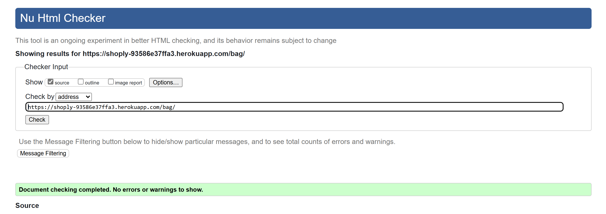 | |
| checkout | checkout.html | 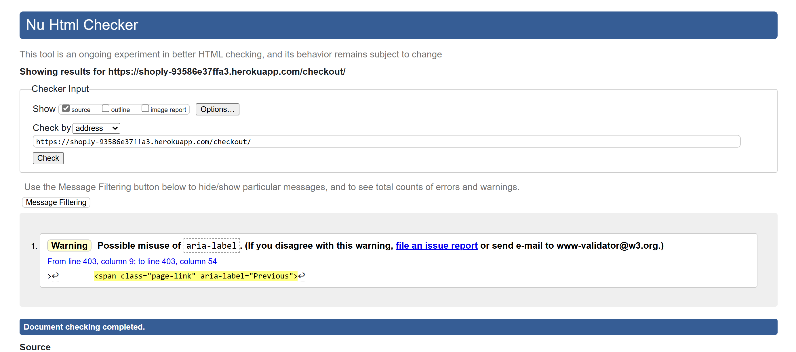 | |
| checkout | checkout_success.html | 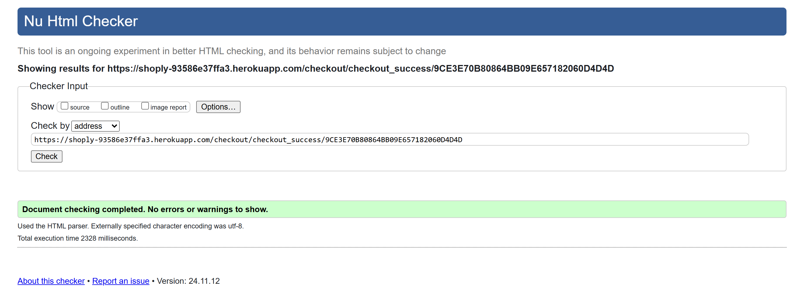 | |
| home | index.html | 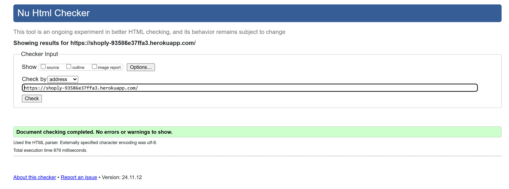 | |
| products | add_products.html | 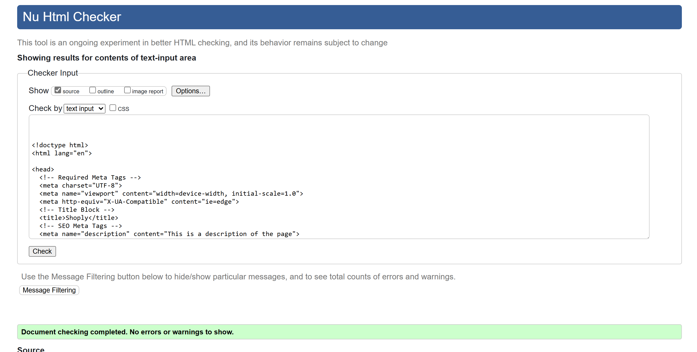 | |
| products | edit_products.html | 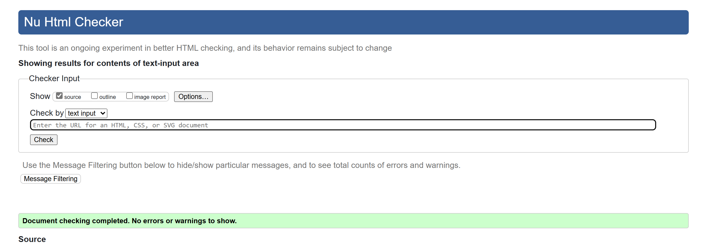 | |
| products | product_detail.html |  | |
| products | products.html | 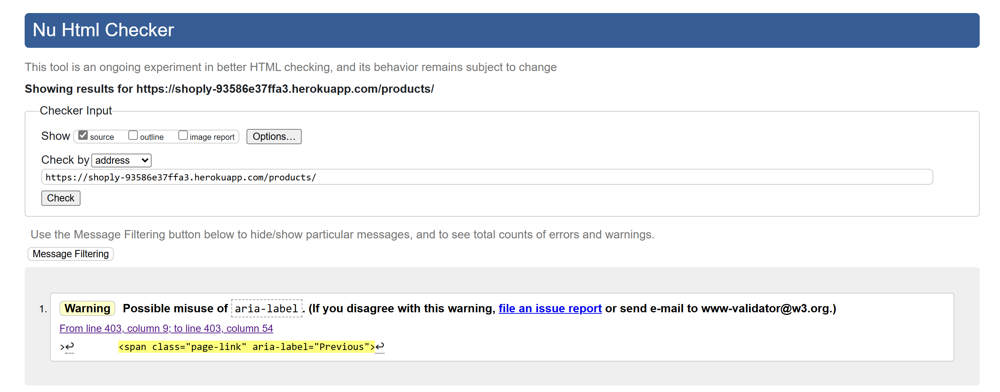 | |
| user profile | profile.html | 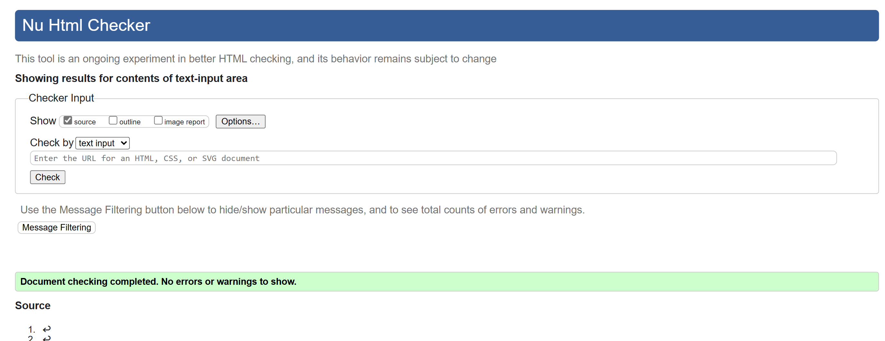 | |

### CSS

I have used the recommended [CSS Jigsaw Validator](https://jigsaw.w3.org/css-validator) to validate all of my CSS files.

| Directory | File | Screenshot | Notes |
| --- | --- | --- | --- |
| checkout | checkout.css | 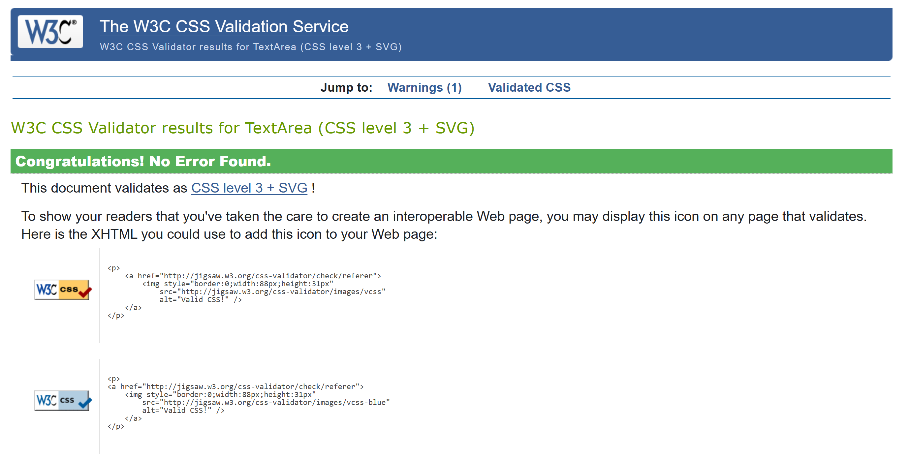 | |
| profiles | profile.css | 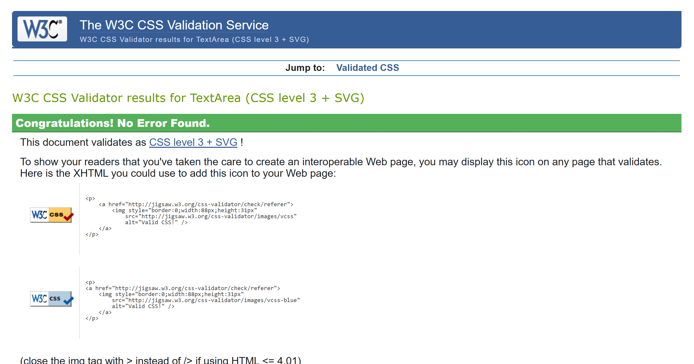 | |
| static | style.css | 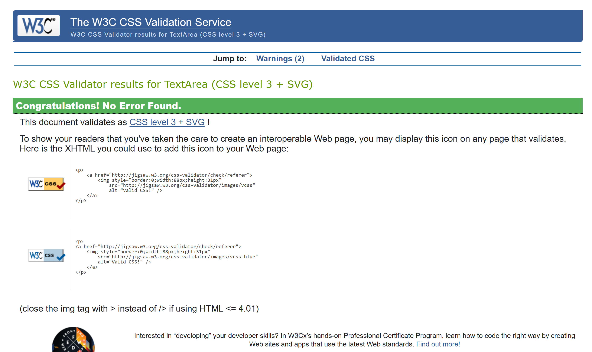 | |

### JavaScript

I have used the recommended [JShint Validator](https://jshint.com) to validate all of my JS files.

| Directory | File | Screenshot | Notes |
| --- | --- | --- | --- |
| checkout | stripe_elements.js | 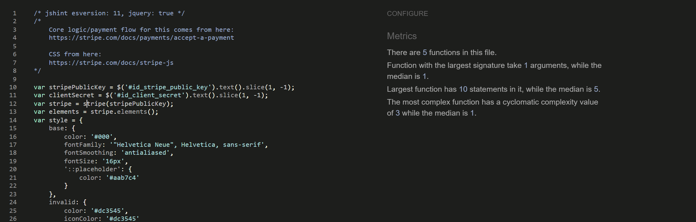 | |
| profiles | countryfield.js | 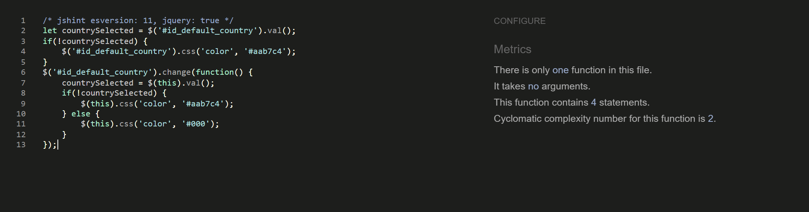 | |
| static | main.js | 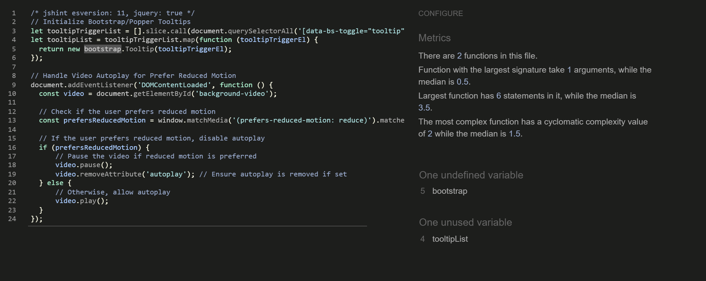 | The errors shown in this screenshot are related to the Bootstrap Tooltip JavaScript. For reference, I've included the official documentation here: [Bootstrap Tooltip Documentation](https://getbootstrap.com/docs/5.0/components/tooltips/).|

### Python

I have used the recommended [PEP8 CI Python Linter](https://pep8ci.herokuapp.com) to validate all of my Python files.

| Directory | File | CI URL | Screenshot | Notes |
| --- | --- | --- | --- | --- |
| bag | admin.py | [PEP8 CI](https://pep8ci.herokuapp.com/https://raw.githubusercontent.com/patrickaod/Shoply/main/bag/admin.py) | 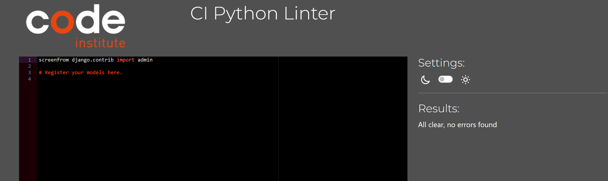 | |
| bag | contexts.py | [PEP8 CI](https://pep8ci.herokuapp.com/https://raw.githubusercontent.com/patrickaod/Shoply/main/bag/contexts.py) | .png) | |
| bag | models.py | [PEP8 CI](https://pep8ci.herokuapp.com/https://raw.githubusercontent.com/patrickaod/Shoply/main/bag/models.py) | 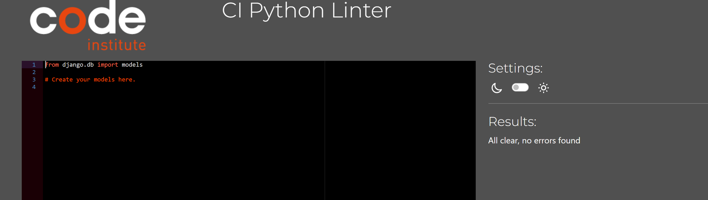 | |
| bag | bag_tools.py | [PEP8 CI](https://pep8ci.herokuapp.com/https://raw.githubusercontent.com/patrickaod/Shoply/main/bag/templatetags/bag_tools.py) | 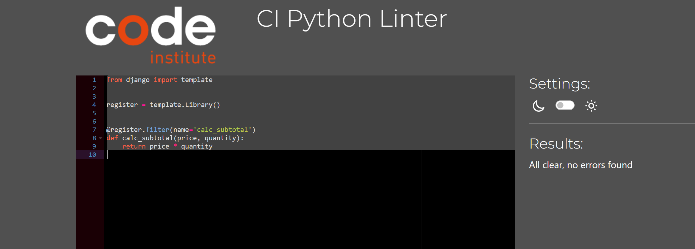 | |
| bag | urls.py | [PEP8 CI](https://pep8ci.herokuapp.com/https://raw.githubusercontent.com/patrickaod/Shoply/main/bag/urls.py) |  | |
| bag | views.py | [PEP8 CI](https://pep8ci.herokuapp.com/https://raw.githubusercontent.com/patrickaod/Shoply/main/bag/views.py) | 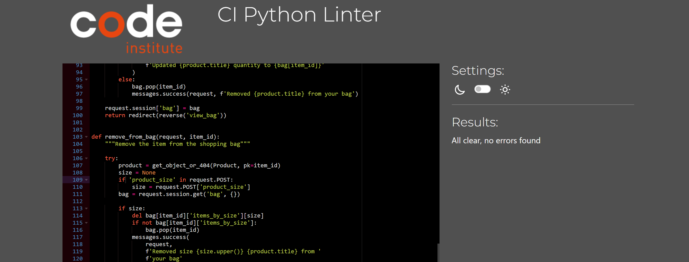 | |
| checkout | admin.py | [PEP8 CI](https://pep8ci.herokuapp.com/https://raw.githubusercontent.com/patrickaod/Shoply/main/checkout/admin.py) | 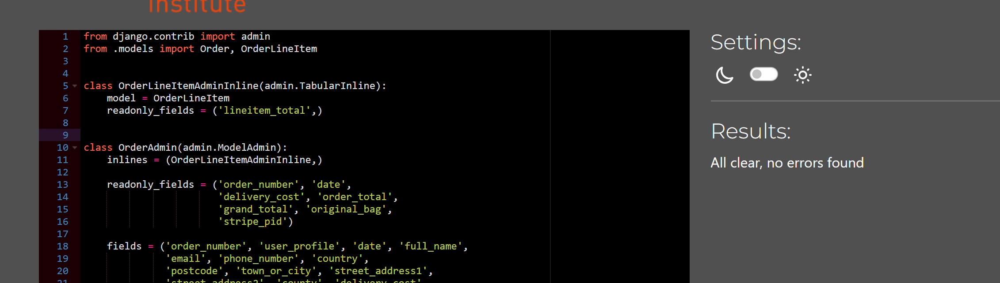 | |
| checkout | forms.py | [PEP8 CI](https://pep8ci.herokuapp.com/https://raw.githubusercontent.com/patrickaod/Shoply/main/checkout/forms.py) | 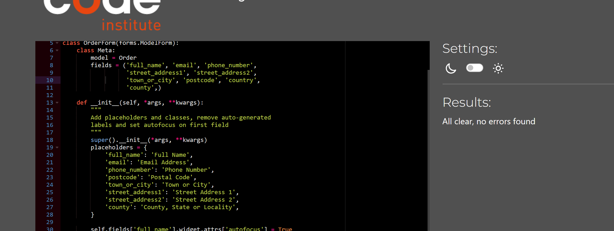 | |
| checkout | models.py | [PEP8 CI](https://pep8ci.herokuapp.com/https://raw.githubusercontent.com/patrickaod/Shoply/main/checkout/models.py) | 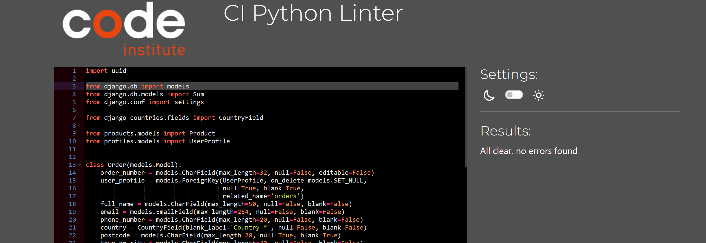 | |
| checkout | signals.py | [PEP8 CI](https://pep8ci.herokuapp.com/https://raw.githubusercontent.com/patrickaod/Shoply/main/checkout/signals.py) | 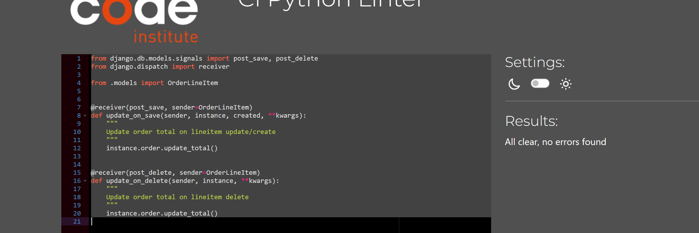 | |
| checkout | urls.py | [PEP8 CI](https://pep8ci.herokuapp.com/https://raw.githubusercontent.com/patrickaod/Shoply/main/checkout/urls.py) | 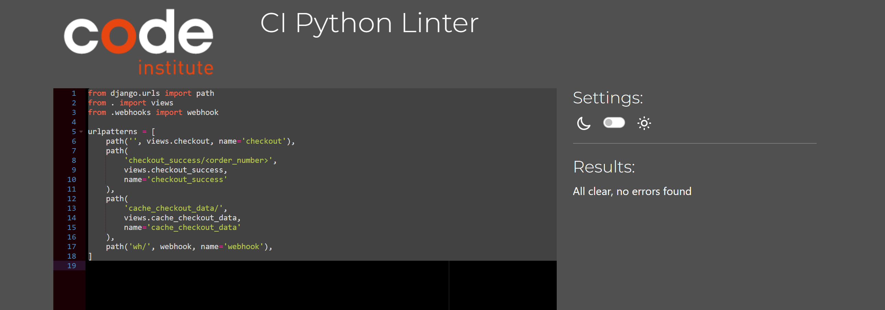 | |
| checkout | views.py | [PEP8 CI](https://pep8ci.herokuapp.com/https://raw.githubusercontent.com/patrickaod/Shoply/main/checkout/views.py) |  | |
| checkout | webhook_handler.py | [PEP8 CI](https://pep8ci.herokuapp.com/https://raw.githubusercontent.com/patrickaod/Shoply/main/checkout/webhook_handler.py) | 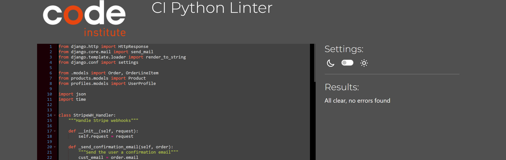 | |
| checkout | webhooks.py | [PEP8 CI](https://pep8ci.herokuapp.com/https://raw.githubusercontent.com/patrickaod/Shoply/main/checkout/webhooks.py) | 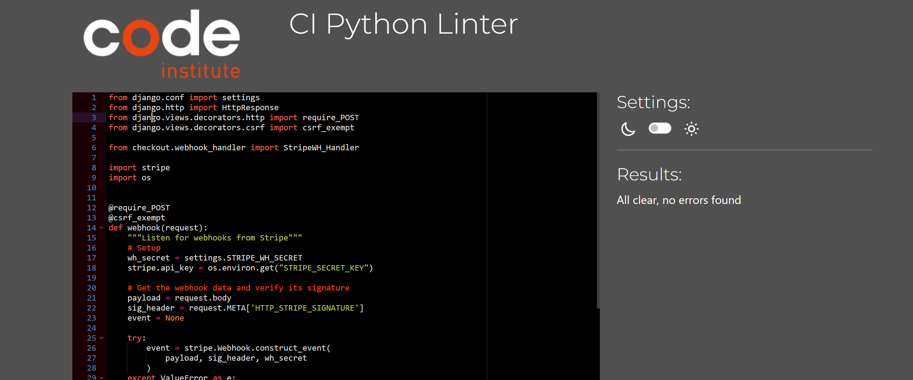 | |
| home | admin.py | [PEP8 CI](https://pep8ci.herokuapp.com/https://raw.githubusercontent.com/patrickaod/Shoply/main/home/admin.py) | 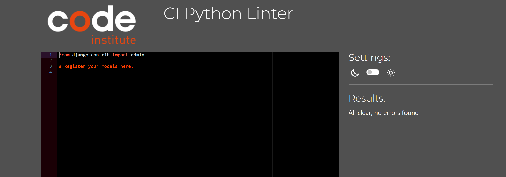 | |
| home | models.py | [PEP8 CI](https://pep8ci.herokuapp.com/https://raw.githubusercontent.com/patrickaod/Shoply/main/home/models.py) |  | |
| home | urls.py | [PEP8 CI](https://pep8ci.herokuapp.com/https://raw.githubusercontent.com/patrickaod/Shoply/main/home/urls.py) | 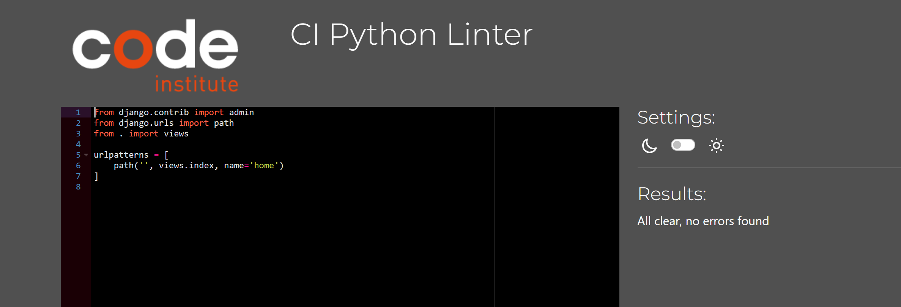 | |
| home | views.py | [PEP8 CI](https://pep8ci.herokuapp.com/https://raw.githubusercontent.com/patrickaod/Shoply/main/home/views.py) | 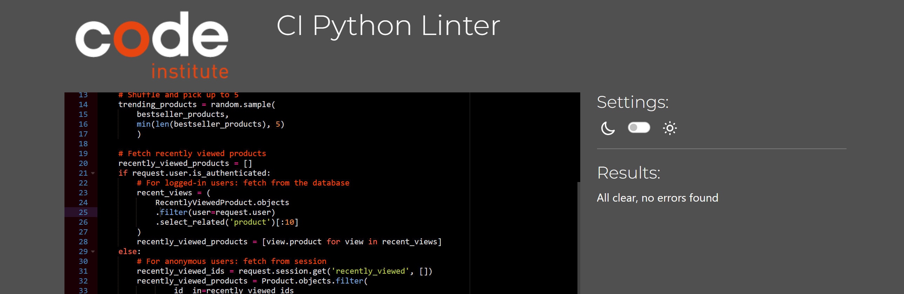 | |
|  | manage.py | [PEP8 CI](https://pep8ci.herokuapp.com/https://raw.githubusercontent.com/patrickaod/Shoply/main/manage.py) | 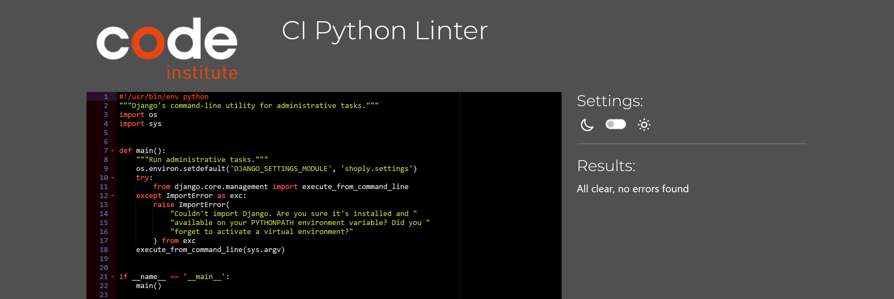 | |
| products | admin.py | [PEP8 CI](https://pep8ci.herokuapp.com/https://raw.githubusercontent.com/patrickaod/Shoply/main/products/admin.py) | 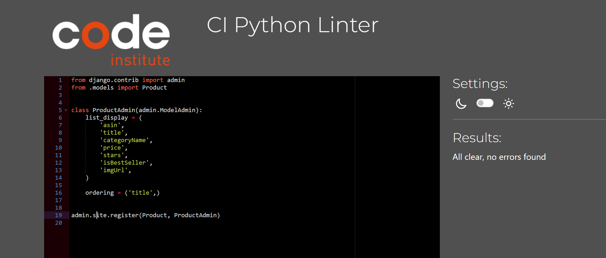 | |
| products | contexts.py | [PEP8 CI](https://pep8ci.herokuapp.com/https://raw.githubusercontent.com/patrickaod/Shoply/main/products/contexts.py) | 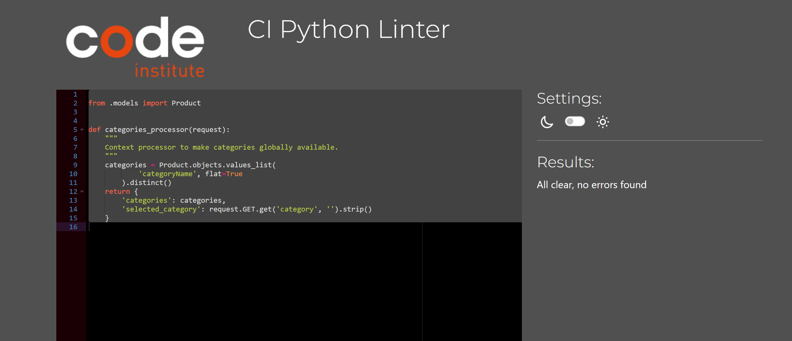 | |
| products | forms.py | [PEP8 CI](https://pep8ci.herokuapp.com/https://raw.githubusercontent.com/patrickaod/Shoply/main/products/forms.py) | 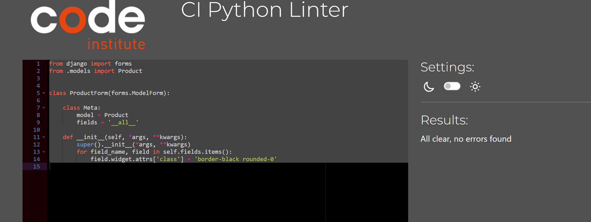 | |
| products | models.py | [PEP8 CI](https://pep8ci.herokuapp.com/https://raw.githubusercontent.com/patrickaod/Shoply/main/products/models.py) | 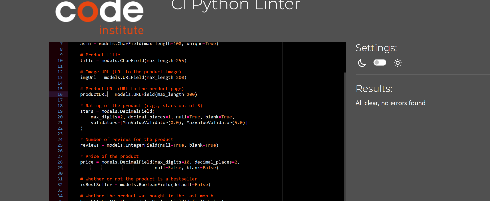 | |
| products | urls.py | [PEP8 CI](https://pep8ci.herokuapp.com/https://raw.githubusercontent.com/patrickaod/Shoply/main/products/urls.py) | 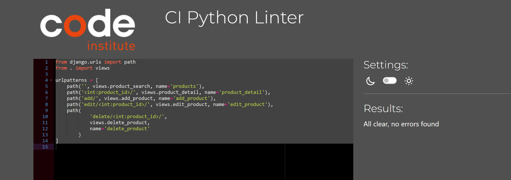 | |
| products | views.py | [PEP8 CI](https://pep8ci.herokuapp.com/https://raw.githubusercontent.com/patrickaod/Shoply/main/products/views.py) | 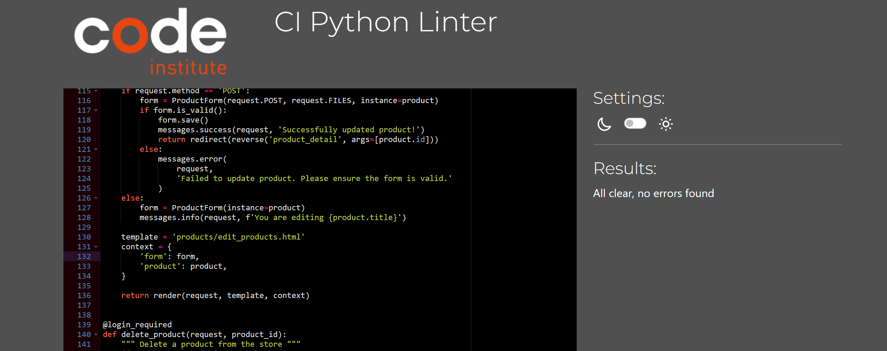 | |
| profiles | admin.py | [PEP8 CI](https://pep8ci.herokuapp.com/https://raw.githubusercontent.com/patrickaod/Shoply/main/profiles/admin.py) | 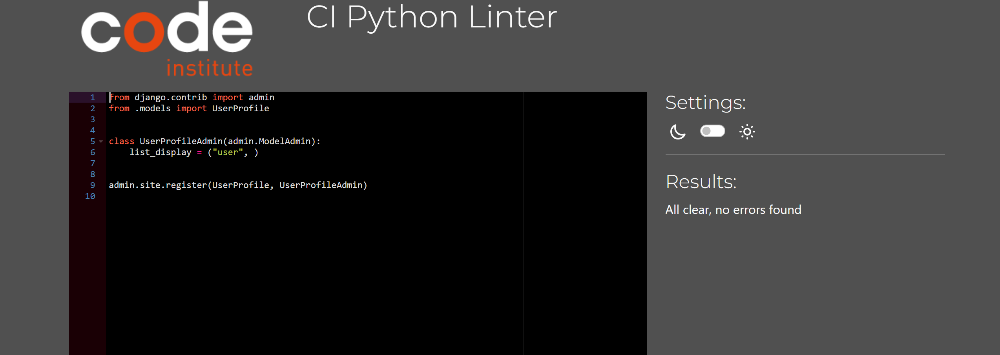 | |
| profiles | forms.py | [PEP8 CI](https://pep8ci.herokuapp.com/https://raw.githubusercontent.com/patrickaod/Shoply/main/profiles/forms.py) | 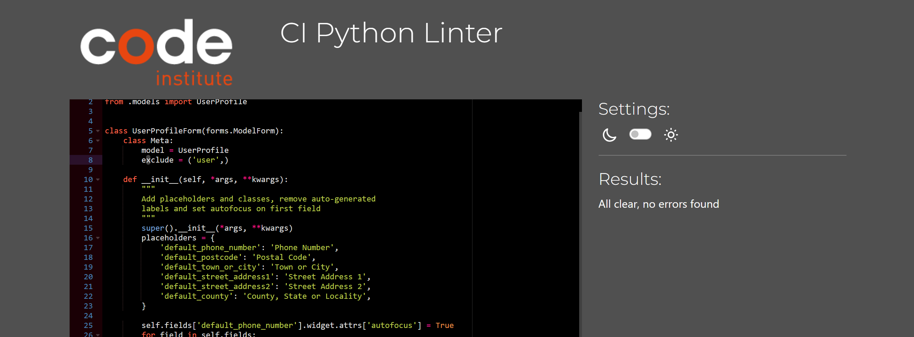 | |
| profiles | models.py | [PEP8 CI](https://pep8ci.herokuapp.com/https://raw.githubusercontent.com/patrickaod/Shoply/main/profiles/models.py) | 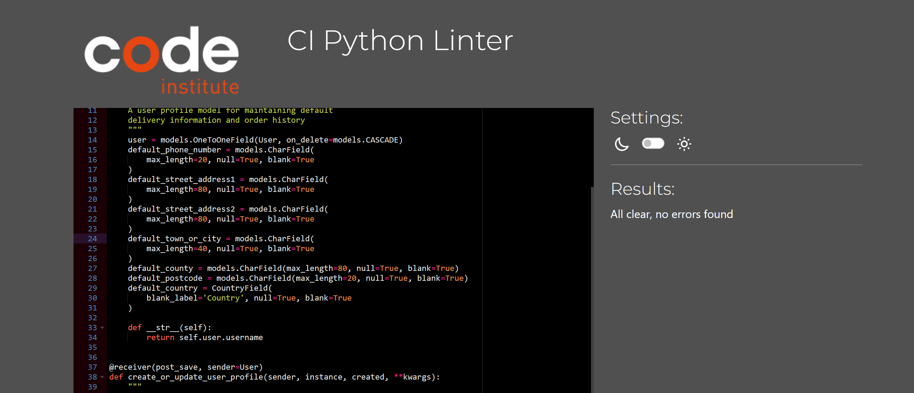 | |
| profiles | urls.py | [PEP8 CI](https://pep8ci.herokuapp.com/https://raw.githubusercontent.com/patrickaod/Shoply/main/profiles/urls.py) |  | |
| profiles | views.py | [PEP8 CI](https://pep8ci.herokuapp.com/https://raw.githubusercontent.com/patrickaod/Shoply/main/profiles/views.py) | 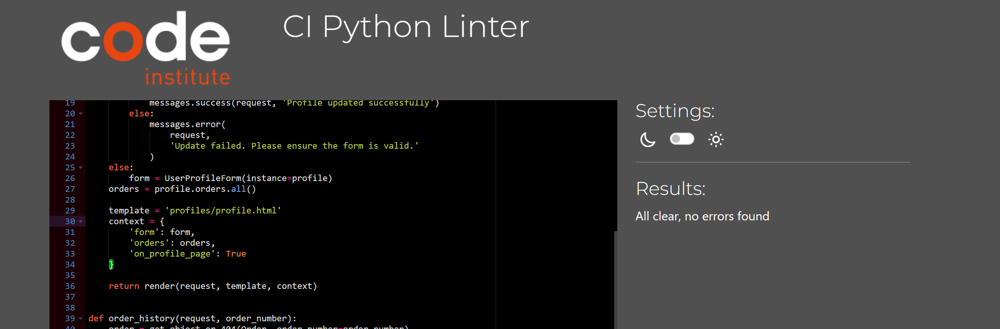 | |
| shoply | cvs_to_json.py | [PEP8 CI](https://pep8ci.herokuapp.com/https://raw.githubusercontent.com/patrickaod/Shoply/main/shoply/management/commands/cvs_to_json.py) | 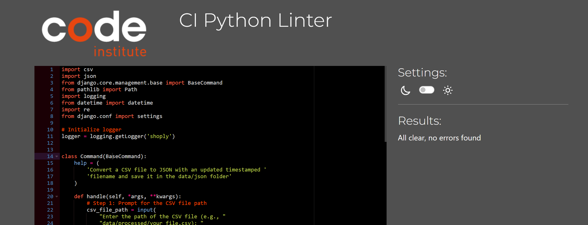 | |
| shoply | dataset_processor.py | [PEP8 CI](https://pep8ci.herokuapp.com/https://raw.githubusercontent.com/patrickaod/Shoply/main/shoply/management/commands/dataset_processor.py) | 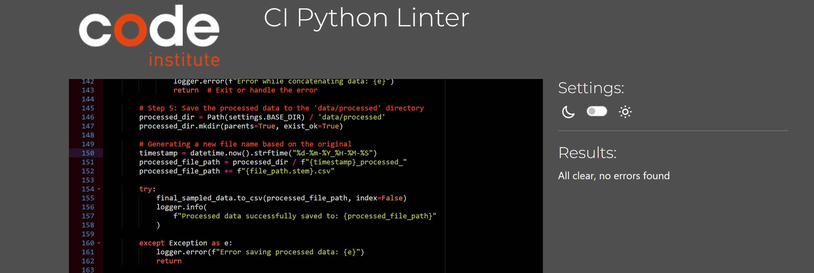 | |
| shoply | kaggle_api_handler.py | [PEP8 CI](https://pep8ci.herokuapp.com/https://raw.githubusercontent.com/patrickaod/Shoply/main/shoply/management/commands/kaggle_api_handler.py) | 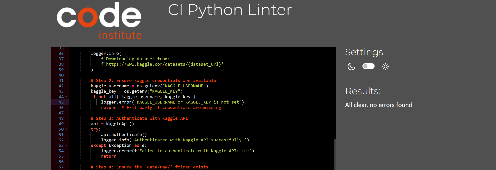 | |
| shoply | settings.py | [PEP8 CI](https://pep8ci.herokuapp.com/https://raw.githubusercontent.com/patrickaod/Shoply/main/shoply/settings.py) |  | |
| shoply | urls.py | [PEP8 CI](https://pep8ci.herokuapp.com/https://raw.githubusercontent.com/patrickaod/Shoply/main/shoply/urls.py) | 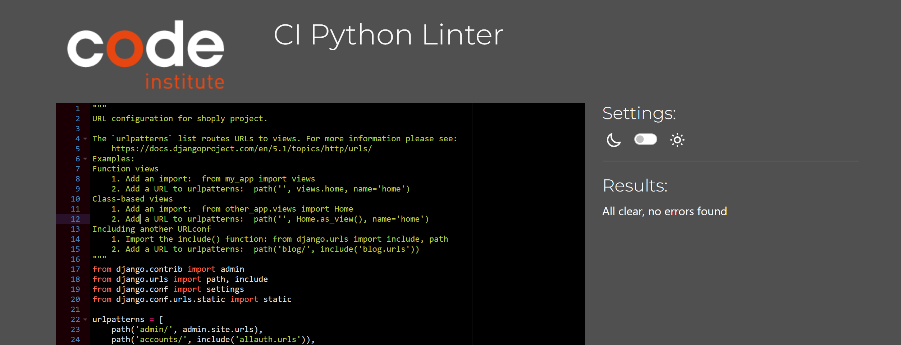 | |
| user_activity | admin.py | [PEP8 CI](https://pep8ci.herokuapp.com/https://raw.githubusercontent.com/patrickaod/Shoply/main/user_activity/admin.py) | 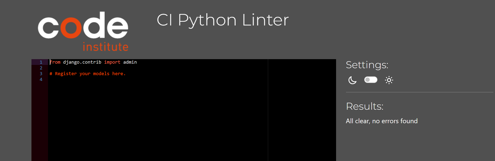 | |
| user_activity | models.py | [PEP8 CI](https://pep8ci.herokuapp.com/https://raw.githubusercontent.com/patrickaod/Shoply/main/user_activity/models.py) | 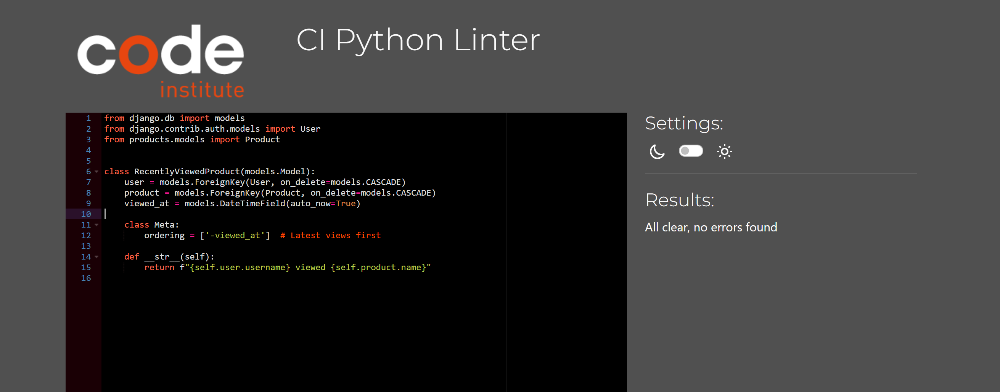 | |
| user_activity | views.py | [PEP8 CI](https://pep8ci.herokuapp.com/https://raw.githubusercontent.com/patrickaod/Shoply/main/user_activity/views.py) |  | |

## Browser Compatibility

Cross-browser testing is important to make sure your website works well on different browsers, like Chrome, Firefox, Safari, and Edge. Since each browser can show things a little differently, testing helps catch any problems with how your site looks or works.

I've tested my deployed project on multiple browsers to check for compatibility issues.

| Browser | Home | Product | Product Details | Checkout | Notes |
| --- | --- | --- | --- | --- | --- |
| Chrome |  | 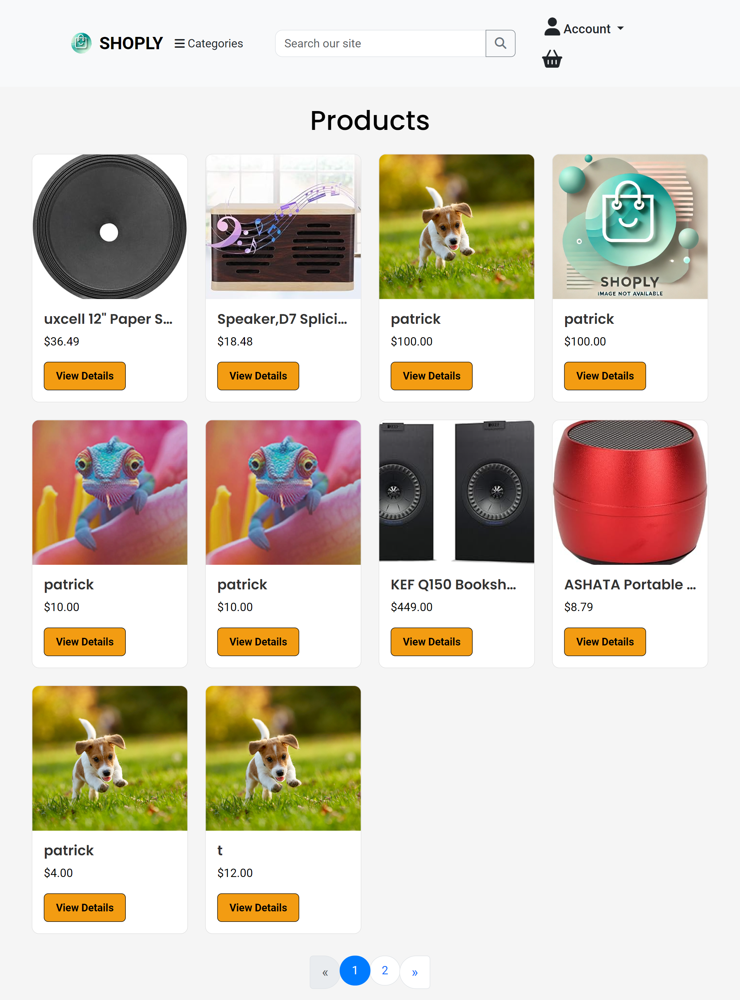 | 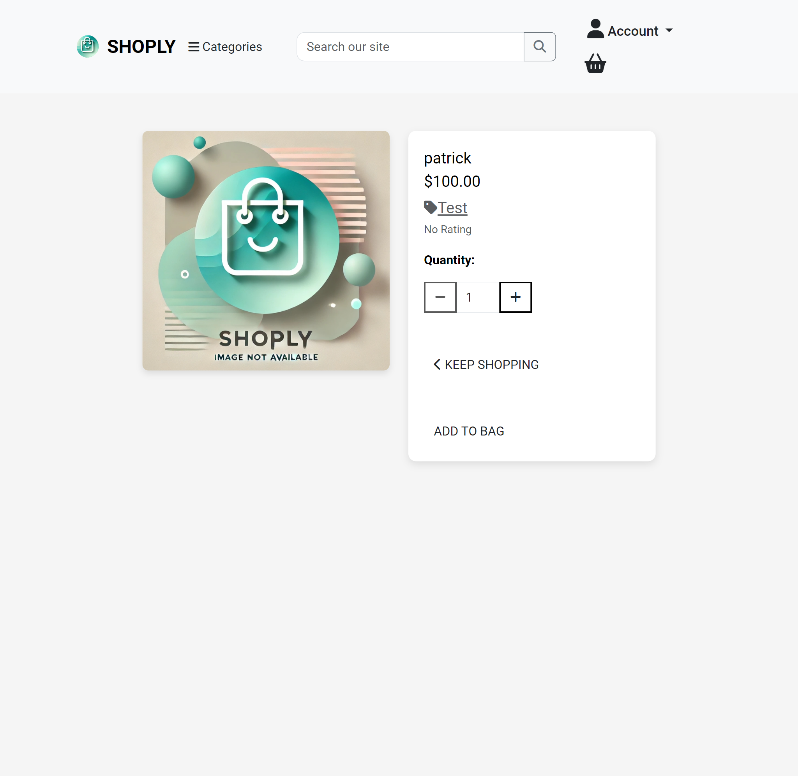 | 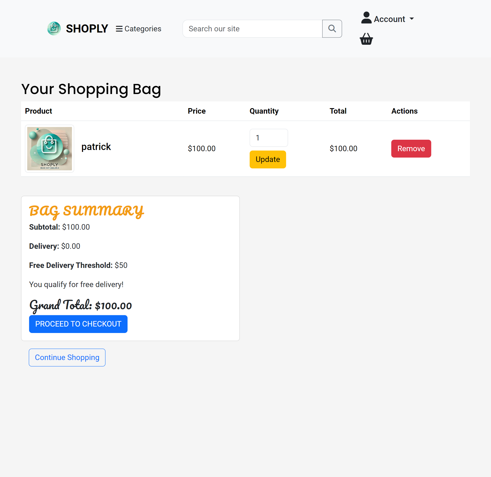 | Works as expected |
| Edge |  | 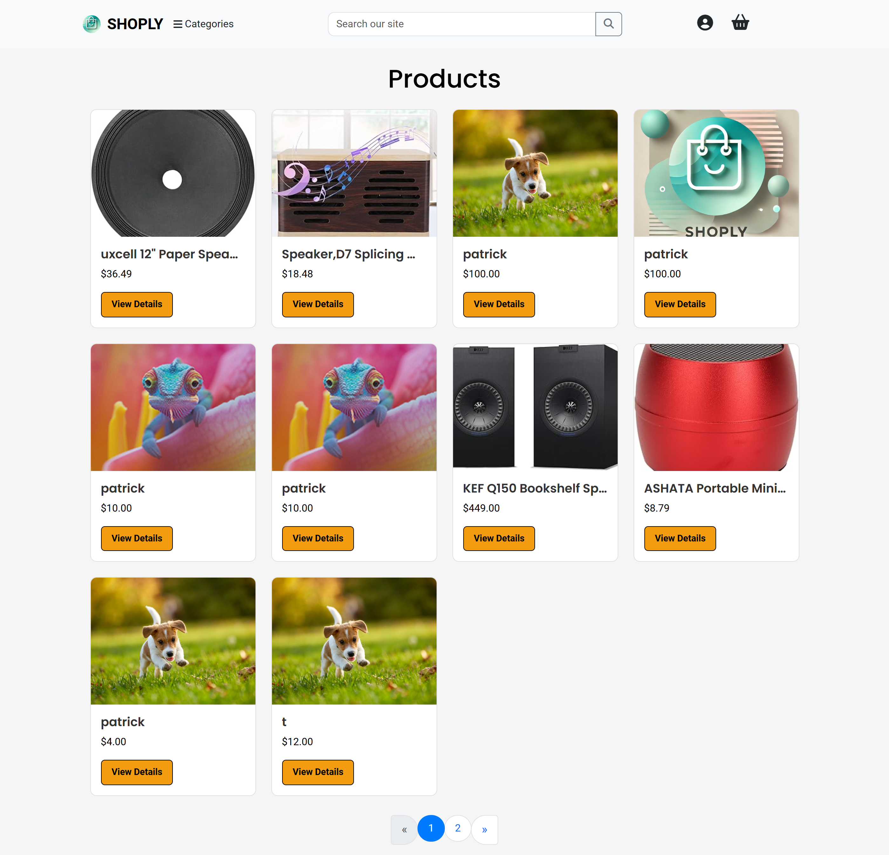 | 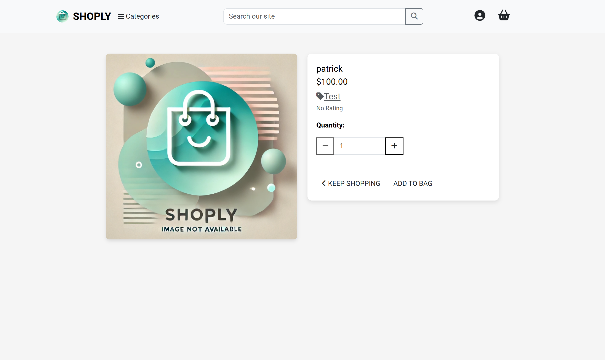 |  | Works as expected |
| Firefox |  |  |  |  | Works as expected |

## Responsiveness

I've tested my deployed project on multiple devices to check for responsiveness issues.

| Device | Home | Product | Details | Checkout | Notes |
| --- | --- | --- | --- | --- | --- |
| Mobile (DevTools) |  |  |  |  | Works as expected |
| Tablet (DevTools) |  |  |  |  | Works as expected |
| Desktop |  |  |  |  | Works as expected |

## Lighthouse Audit

I've tested my deployed project using the Lighthouse Audit tool to check for any major issues.

After reviewing my Google Lighthouse results, I can see there’s room for improvement in a few areas. My mobile performance score of 60 is lower than I’d like, so I plan to optimize loading speeds and reduce file sizes. I’m happy with the accessibility score of 85+, but I know I could improve it further by refining color contrast and ARIA roles. The best practices score of 75 shows there are some security and optimization issues to address, and while my SEO score of 100 is great, I’ll need to keep an eye on that. On desktop, performance at 70+ still needs some attention, and best practices (74) could be improved too. I’ll focus on improving these areas while keeping my accessibility and SEO scores strong.

| Page | Mobile | Desktop | Notes |
| --- | --- | --- | --- |
| Home |  |  | Mobile performance needs improvement, while accessibility, best practices, and SEO can be fine-tuned over time. |
| Product |  |  | Some minor warnings, mostly image loading times |
| Checkout |  |  | Slow response time due to image rendering |

## User Story Testing

| User Story | Screenshot |
| --- | --- |
| As a shopper, I would like to view a list of products, so that I can select some to purchase. |  |
| As a shopper, I would like to view specific categories, so that I can find something quickly. |  |
| As a shopper, I would like to select out a product, so that I focus on the product itself. |  |
| As a new site user, I would like to easily login, so that I can access my information quickly. |  |
| As a new site user, I would like to easily register, so that I can view my personal profile. |  |
| As a new site user, I would like to recieve email confirmation, so that I can verify my purchase. |  |
| As a returning site user, I would like to have my orders saved, so that I can review my purchases. |  |
| As a returning site user, I would like to quick access to products I've seen before, so that I don't have to write anything down. |  |
| As a returning site user, I would like to quickly see the most popular items, so that I can find some quick christmas gifts. |  |
| As a site administrator, I should be able to modify profiles, so that I can maintain site security. |  |
| As a site administrator, I should be able to see all products, so that I can check site inventory. |  |
| As a site administrator, I should be able to see change products, so that I can update site inventory. |  |

## Automated Testing

I fully acknowledge that automated testing would be an essential part of a comprehensive testing strategy in a real-world scenario. In this case, my testing approach has been more manual, focusing on key aspects of browser compatibility and user experience. 

## Bugs

- The HTML validator will show an error with the body tags if another tag is missing.

    .png)

    - To fix this, I replacing the missing tag.

- Python `E501 line too long` (93 > 79 characters)

    .png)

    - To fix this by re-oganising onto different lines or shortening phrasing.

## Unfixed Bugs

- There are two bugs in the JSHint linter that can’t be fixed because they’re tied to how Bootstrap is structured internally. These issues come from the code used to enable Popper.js tooltips, and fixing them would go beyond the scope of this project. For now, they’ve been noted and left to be addressed later.

    

- There was a warning in the HTML validator about a possible misuse of the aria-label, but after checking, everything seemed fine. Fixing this would require reaching out to the W3C team, and since it’s just a warning and doesn’t appear to be an issue with my code, I decided to leave it for now.

    .png)

> [!NOTE]  
> There are no remaining bugs that I am aware of.
