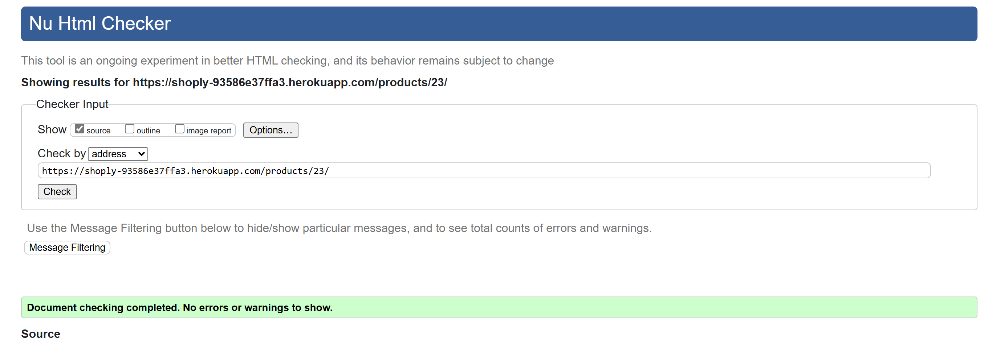
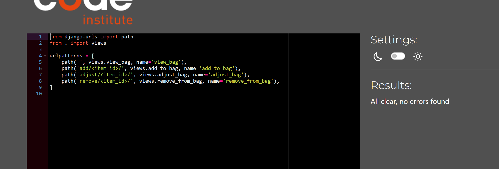
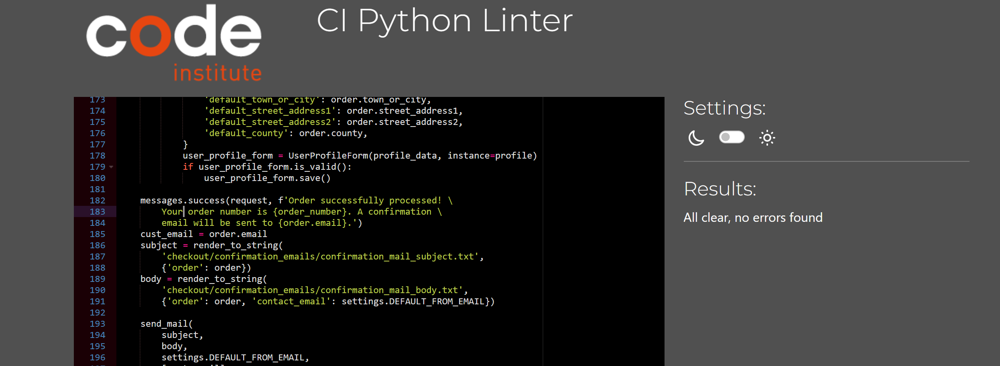
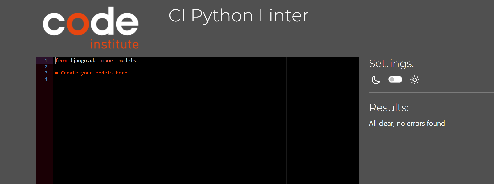

# Testing

> [!NOTE]  
> Return back to the [README.md](README.md) file.

## Code Validation

### HTML

I have used the recommended [HTML W3C Validator](https://validator.w3.org) to validate all of my HTML files.

| Directory | File | Screenshot | Notes |
| --- | --- | --- | --- |
| bag | bag.html |  | |
| checkout | checkout.html |  | |
| checkout | checkout_success.html |  | |
| home | index.html |  | |
| products | add_products.html |  | |
| products | edit_products.html |  | |
| products | product_detail.html |  | |
| products | products.html |  | |
| user profile | profile.html |  | |

### CSS

I have used the recommended [CSS Jigsaw Validator](https://jigsaw.w3.org/css-validator) to validate all of my CSS files.

| Directory | File | Screenshot | Notes |
| --- | --- | --- | --- |
| checkout | checkout.css |  | |
| profiles | profile.css |  | |
| static | style.css |  | |

### JavaScript

I have used the recommended [JShint Validator](https://jshint.com) to validate all of my JS files.

| Directory | File | Screenshot | Notes |
| --- | --- | --- | --- |
| checkout | stripe_elements.js |  | |
| profiles | countryfield.js |  | |
| static | main.js |  | The errors shown in this screenshot are related to the Bootstrap Tooltip JavaScript. For reference, I've included the official documentation here: [Bootstrap Tooltip Documentation](https://getbootstrap.com/docs/5.0/components/tooltips/).|

### Python

I have used the recommended [PEP8 CI Python Linter](https://pep8ci.herokuapp.com) to validate all of my Python files.

| Directory | File | CI URL | Screenshot | Notes |
| --- | --- | --- | --- | --- |
| bag | admin.py | [PEP8 CI](https://pep8ci.herokuapp.com/https://raw.githubusercontent.com/patrickaod/Shoply/main/bag/admin.py) |  | |
| bag | contexts.py | [PEP8 CI](https://pep8ci.herokuapp.com/https://raw.githubusercontent.com/patrickaod/Shoply/main/bag/contexts.py) | .png) | |
| bag | models.py | [PEP8 CI](https://pep8ci.herokuapp.com/https://raw.githubusercontent.com/patrickaod/Shoply/main/bag/models.py) |  | |
| bag | bag_tools.py | [PEP8 CI](https://pep8ci.herokuapp.com/https://raw.githubusercontent.com/patrickaod/Shoply/main/bag/templatetags/bag_tools.py) |  | |
| bag | urls.py | [PEP8 CI](https://pep8ci.herokuapp.com/https://raw.githubusercontent.com/patrickaod/Shoply/main/bag/urls.py) |  | |
| bag | views.py | [PEP8 CI](https://pep8ci.herokuapp.com/https://raw.githubusercontent.com/patrickaod/Shoply/main/bag/views.py) |  | |
| checkout | admin.py | [PEP8 CI](https://pep8ci.herokuapp.com/https://raw.githubusercontent.com/patrickaod/Shoply/main/checkout/admin.py) |  | |
| checkout | forms.py | [PEP8 CI](https://pep8ci.herokuapp.com/https://raw.githubusercontent.com/patrickaod/Shoply/main/checkout/forms.py) |  | |
| checkout | models.py | [PEP8 CI](https://pep8ci.herokuapp.com/https://raw.githubusercontent.com/patrickaod/Shoply/main/checkout/models.py) |  | |
| checkout | signals.py | [PEP8 CI](https://pep8ci.herokuapp.com/https://raw.githubusercontent.com/patrickaod/Shoply/main/checkout/signals.py) |  | |
| checkout | urls.py | [PEP8 CI](https://pep8ci.herokuapp.com/https://raw.githubusercontent.com/patrickaod/Shoply/main/checkout/urls.py) |  | |
| checkout | views.py | [PEP8 CI](https://pep8ci.herokuapp.com/https://raw.githubusercontent.com/patrickaod/Shoply/main/checkout/views.py) |  | |
| checkout | webhook_handler.py | [PEP8 CI](https://pep8ci.herokuapp.com/https://raw.githubusercontent.com/patrickaod/Shoply/main/checkout/webhook_handler.py) |  | |
| checkout | webhooks.py | [PEP8 CI](https://pep8ci.herokuapp.com/https://raw.githubusercontent.com/patrickaod/Shoply/main/checkout/webhooks.py) |  | |
| home | admin.py | [PEP8 CI](https://pep8ci.herokuapp.com/https://raw.githubusercontent.com/patrickaod/Shoply/main/home/admin.py) |  | |
| home | models.py | [PEP8 CI](https://pep8ci.herokuapp.com/https://raw.githubusercontent.com/patrickaod/Shoply/main/home/models.py) |  | |
| home | urls.py | [PEP8 CI](https://pep8ci.herokuapp.com/https://raw.githubusercontent.com/patrickaod/Shoply/main/home/urls.py) |  | |
| home | views.py | [PEP8 CI](https://pep8ci.herokuapp.com/https://raw.githubusercontent.com/patrickaod/Shoply/main/home/views.py) |  | |
|  | manage.py | [PEP8 CI](https://pep8ci.herokuapp.com/https://raw.githubusercontent.com/patrickaod/Shoply/main/manage.py) |  | |
| products | admin.py | [PEP8 CI](https://pep8ci.herokuapp.com/https://raw.githubusercontent.com/patrickaod/Shoply/main/products/admin.py) |  | |
| products | contexts.py | [PEP8 CI](https://pep8ci.herokuapp.com/https://raw.githubusercontent.com/patrickaod/Shoply/main/products/contexts.py) |  | |
| products | forms.py | [PEP8 CI](https://pep8ci.herokuapp.com/https://raw.githubusercontent.com/patrickaod/Shoply/main/products/forms.py) |  | |
| products | models.py | [PEP8 CI](https://pep8ci.herokuapp.com/https://raw.githubusercontent.com/patrickaod/Shoply/main/products/models.py) |  | |
| products | urls.py | [PEP8 CI](https://pep8ci.herokuapp.com/https://raw.githubusercontent.com/patrickaod/Shoply/main/products/urls.py) |  | |
| products | views.py | [PEP8 CI](https://pep8ci.herokuapp.com/https://raw.githubusercontent.com/patrickaod/Shoply/main/products/views.py) |  | |
| profiles | admin.py | [PEP8 CI](https://pep8ci.herokuapp.com/https://raw.githubusercontent.com/patrickaod/Shoply/main/profiles/admin.py) |  | |
| profiles | forms.py | [PEP8 CI](https://pep8ci.herokuapp.com/https://raw.githubusercontent.com/patrickaod/Shoply/main/profiles/forms.py) |  | |
| profiles | models.py | [PEP8 CI](https://pep8ci.herokuapp.com/https://raw.githubusercontent.com/patrickaod/Shoply/main/profiles/models.py) |  | |
| profiles | urls.py | [PEP8 CI](https://pep8ci.herokuapp.com/https://raw.githubusercontent.com/patrickaod/Shoply/main/profiles/urls.py) |  | |
| profiles | views.py | [PEP8 CI](https://pep8ci.herokuapp.com/https://raw.githubusercontent.com/patrickaod/Shoply/main/profiles/views.py) |  | |
| shoply | cvs_to_json.py | [PEP8 CI](https://pep8ci.herokuapp.com/https://raw.githubusercontent.com/patrickaod/Shoply/main/shoply/management/commands/cvs_to_json.py) |  | |
| shoply | dataset_processor.py | [PEP8 CI](https://pep8ci.herokuapp.com/https://raw.githubusercontent.com/patrickaod/Shoply/main/shoply/management/commands/dataset_processor.py) |  | |
| shoply | kaggle_api_handler.py | [PEP8 CI](https://pep8ci.herokuapp.com/https://raw.githubusercontent.com/patrickaod/Shoply/main/shoply/management/commands/kaggle_api_handler.py) |  | |
| shoply | settings.py | [PEP8 CI](https://pep8ci.herokuapp.com/https://raw.githubusercontent.com/patrickaod/Shoply/main/shoply/settings.py) |  | |
| shoply | urls.py | [PEP8 CI](https://pep8ci.herokuapp.com/https://raw.githubusercontent.com/patrickaod/Shoply/main/shoply/urls.py) |  | |
| user_activity | admin.py | [PEP8 CI](https://pep8ci.herokuapp.com/https://raw.githubusercontent.com/patrickaod/Shoply/main/user_activity/admin.py) |  | |
| user_activity | models.py | [PEP8 CI](https://pep8ci.herokuapp.com/https://raw.githubusercontent.com/patrickaod/Shoply/main/user_activity/models.py) |  | |
| user_activity | views.py | [PEP8 CI](https://pep8ci.herokuapp.com/https://raw.githubusercontent.com/patrickaod/Shoply/main/user_activity/views.py) |  | |

## Browser Compatibility

Cross-browser testing is important to make sure your website works well on different browsers, like Chrome, Firefox, Safari, and Edge. Since each browser can show things a little differently, testing helps catch any problems with how your site looks or works.

I've tested my deployed project on multiple browsers to check for compatibility issues.

| Browser | Home | Product | Product Details | Checkout | Notes |
| --- | --- | --- | --- | --- | --- |
| Chrome |  |  |  |  | Works as expected |
| Edge |  |  |  |  | Works as expected |
| Firefox |  |  |  |  | Works as expected |
